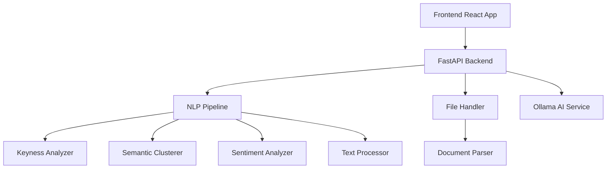
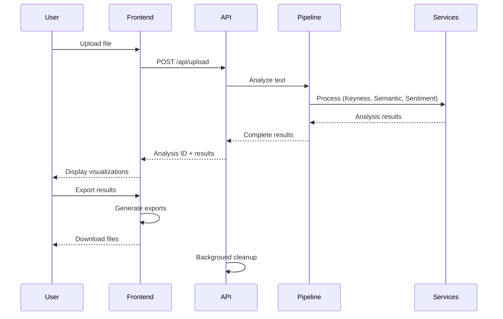

# ReflexAI - Advanced Text Analysis Tool

A comprehensive, privacy-focused text analysis platform that provides deep insights into writing style, linguistic patterns, and content themes using advanced NLP techniques. Perfect for writers, researchers, and content analysts who want professional-grade text analysis without compromising data privacy.

## ✨ Key Features

### 📊 **Advanced Keyness Analysis**
- **Enhanced Keyness Chart**: Interactive D3.js visualization showing both positive and negative keyness
- **Effect Size Visualization**: Horizontal bar chart displaying words that are over/under-represented compared to reference corpus
- **Statistical Significance**: Log-likelihood calculations with confidence metrics
- **Color-coded Results**: Blue bars for positive keyness, red bars for negative keyness

### 🎯 **Interactive Semantic Clustering**
- **Dynamic Cluster Visualization**: Interactive scatter plots with Plotly.js
- **Multiple Clustering Algorithms**: K-means clustering with optimized cluster count
- **Word Relationship Mapping**: Visualize semantic relationships between terms
- **Cluster Statistics**: Detailed metrics for each semantic group

### 💭 **Comprehensive Sentiment Analysis** 
- **Multi-dimensional Analysis**: Overall sentiment scoring with positive/negative/neutral breakdown
- **Visual Sentiment Display**: Pie charts and donut charts showing sentiment distribution
- **Confidence Scoring**: Reliability metrics for sentiment predictions

### 📈 **Detailed Text Statistics**
- **Comprehensive Metrics**: Word count, sentence count, average sentence length
- **Readability Analysis**: Multiple readability scores and complexity metrics  
- **Vocabulary Analysis**: Type-token ratio, lexical diversity measures

### 🔒 **Privacy-First Architecture**
- **Zero Data Retention**: All text deleted immediately after analysis
- **Local Processing**: Core analysis runs locally without external API calls
- **Optional AI Integration**: Ollama integration for enhanced insights (fully local)

### 📊 **Professional Export Options**
- **Multi-format Export**: JSON, PNG, PDF export capabilities
- **Print-ready Charts**: High-quality visualizations for reports
- **Complete Analysis Package**: Export all results with charts and statistics

### 🎨 **Modern User Experience**
- **Responsive Design**: Works seamlessly on desktop and mobile
- **Interactive Visualizations**: Hover tooltips, zoom, pan functionality
- **Real-time Analysis**: Fast processing with progress indicators
- **Clean UI**: Modern interface built with Tailwind CSS

## 🛠️ Technology Stack

### Frontend
- **React 18** with TypeScript for type-safe development
- **D3.js** for advanced custom visualizations  
- **Plotly.js** for interactive scientific charts
- **Chart.js** with react-chartjs-2 for standard charts
- **Tailwind CSS** for responsive styling
- **React Dropzone** for file upload handling
- **Vite** for fast development and building
- **HTML2Canvas & jsPDF** for export functionality

### Backend
- **FastAPI** for high-performance async API
- **Advanced NLP Stack**:
  - **NLTK** for natural language processing
  - **spaCy** for advanced linguistic analysis  
  - **scikit-learn** for machine learning and clustering
  - **Gensim** for topic modeling and word embeddings
  - **TextBlob** for sentiment analysis
- **Data Processing**:
  - **NumPy** & **Pandas** for numerical computing
  - **Matplotlib** & **Seaborn** for data visualization
- **Optional AI Integration**:
  - **Ollama** for local AI model integration
  - **HTTPX** for async HTTP requests

## Quick Start

### Prerequisites
- Docker & Docker Compose
- Make (for easy commands)

### 🚀 One-Command Setup

```bash
# Start everything with one command:
make up

# For first-time setup (includes AI model):
make setup
```

### 📋 Available Commands

```bash
make up       # 🏗️  Build and start all services (main command)
make dev      # 🔧 Start in development mode with logs
make setup    # ⚙️  Complete setup including Ollama model  
make down     # 🛑 Stop all services
make restart  # 🔄 Restart all services
make logs     # 📋 View all service logs
make status   # 📊 Check service status
make health   # 🏥 Check application health
make clean    # 🧹 Clean up containers and volumes
```

### 🌐 Access Points

- **Frontend**: http://localhost:3000
- **Backend API**: http://localhost:8000  
- **API Docs**: http://localhost:8000/docs
- **Health Check**: http://localhost:8000/api/health

---

# 📚 Technical Documentation

## 🏗️ Architecture Overview

ReflexAI is built as a modern, containerized microservices application with a clear separation between frontend presentation, backend processing, and AI enhancement layers. The architecture prioritizes privacy, performance, and scalability.

### System Components



## 🔧 Backend Architecture

### Core Services Overview

The backend follows a modular service-oriented architecture with clearly separated concerns:

#### 1. **Analysis Pipeline** (`backend/app/services/analysis_pipeline.py`)
**Purpose**: Orchestrates the complete text analysis workflow
**Key Features**:
- Unified processing pipeline for all analysis types
- Parallel processing of multiple analysis stages
- Comprehensive error handling and logging
- Performance optimization with timing metrics
- Status tracking and progress reporting

**Processing Stages**:
1. **Text Preprocessing**: Cleaning and normalization (`TextProcessor`)
2. **Statistical Analysis**: Word count, readability metrics, vocabulary richness
3. **Keyness Analysis**: Log-likelihood calculations for word significance
4. **Semantic Clustering**: K-means clustering with TF-IDF vectorization
5. **Sentiment Analysis**: Multi-dimensional sentiment scoring
6. **AI Insights**: Optional Ollama-powered thematic analysis

#### 2. **Text Processor** (`backend/app/services/text_processor.py`)
**Purpose**: Advanced text preprocessing and linguistic analysis
**Key Features**:
- **spaCy Integration**: Advanced NLP with named entity recognition
- **NLTK Integration**: Tokenization, POS tagging, stopword removal
- **Fallback Processing**: Graceful degradation when spaCy unavailable
- **Multilingual Support**: Configurable language models

**Processing Capabilities**:
- Lemmatization for improved clustering accuracy
- Named Entity Recognition (NER) for content insights
- Advanced tokenization with linguistic analysis
- Stop word filtering and text normalization

#### 3. **Keyness Analyzer** (`backend/app/services/keyness_analyzer.py`)
**Purpose**: Statistical analysis of word significance and distinctiveness
**Algorithm**: Log-likelihood ratio with effect size calculation
**Key Features**:
- **Positive Keyness**: Words over-represented vs reference corpus
- **Negative Keyness**: Words under-represented (missing/rare)
- **Effect Size Calculation**: Standardized difference measures
- **Confidence Scoring**: Statistical reliability metrics
- **Reference Corpus**: Default English frequency baseline

**Mathematical Foundation**:
```python
# Log-likelihood calculation
score = 2 * observed_freq * log(observed_freq / expected_freq)
effect_size = score / sqrt(observed_freq)
```

#### 4. **Semantic Clusterer** (`backend/app/services/semantic_clustering.py`)
**Purpose**: Groups semantically related content using machine learning
**Algorithm**: K-means clustering with TF-IDF vectorization and PCA dimensionality reduction
**Key Features**:
- **Adaptive Clustering**: Dynamic cluster count based on content
- **TF-IDF Vectorization**: Term frequency-inverse document frequency
- **PCA Reduction**: Dimensionality reduction for performance
- **Cluster Labeling**: Automatic theme detection and naming

**Technical Implementation**:
- Sentence-based clustering for semantic coherence
- Feature extraction with stop word filtering
- Fallback clustering for small datasets
- Coordinate generation for visualization

#### 5. **Sentiment Analyzer** (`backend/app/services/sentiment_analyzer.py`)
**Purpose**: Multi-dimensional emotional tone analysis
**Algorithm**: TextBlob polarity and subjectivity analysis
**Key Features**:
- **Overall Sentiment**: Compound polarity score (-1 to +1)
- **Dimensional Breakdown**: Positive, negative, neutral percentages
- **Sentence-level Analysis**: Granular sentiment tracking
- **Confidence Metrics**: Reliability scoring

#### 6. **File Handler** (`backend/app/services/file_handler.py`)
**Purpose**: Secure, optimized file upload and processing system
**Key Features**:
- **Multi-format Support**: 9 document formats via `DocumentParser`
- **Progressive Upload**: Chunked streaming with progress tracking
- **Memory Optimization**: Memory mapping for large files (>1MB)
- **Privacy Protection**: Automatic file deletion after processing
- **Security Controls**: File size limits, format validation
- **Background Cleanup**: Automated old file removal

**Supported Formats**:
- `.txt` - Plain text
- `.docx` - Microsoft Word (2007+)
- `.pdf` - PDF documents  
- `.rtf` - Rich Text Format
- `.odt` - OpenDocument Text
- `.html/.htm` - HTML documents
- `.md/.markdown` - Markdown files

#### 7. **Document Parser** (`backend/app/services/document_parser.py`)
**Purpose**: Universal document format parsing and text extraction
**Architecture**: Modular parser system with graceful fallbacks
**Key Features**:
- **Format Detection**: MIME type and extension validation
- **Library Management**: Dynamic availability checking
- **Content Extraction**: Text-only extraction with structure preservation
- **Error Handling**: Comprehensive error recovery

**Parser Implementations**:
- **DOCX**: `python-docx` with table extraction
- **PDF**: `PyPDF2` with page-wise processing
- **RTF**: `striprtf` for rich text conversion
- **ODT**: `odfpy` for OpenDocument parsing
- **HTML**: `BeautifulSoup` with tag stripping
- **Markdown**: `markdown` with HTML conversion

#### 8. **Ollama Service** (`backend/app/services/ollama_service.py`)
**Purpose**: Local AI model integration for enhanced insights
**Model**: Llama 3.2 1B (lightweight, privacy-focused)
**Key Features**:
- **Local Processing**: No external API calls
- **Optional Enhancement**: Graceful degradation if unavailable
- **Connection Management**: Health checking and reconnection
- **Model Management**: Automatic model pulling and validation

**AI Capabilities**:
- Thematic analysis and pattern recognition
- Writing style characterization
- Emotional tone interpretation
- Literary analysis insights

### Data Models and Schema

#### Core Data Models (`backend/app/models/analysis.py`)

The application uses Pydantic models for type safety and API documentation:

##### **AnalysisResult**
Primary response model containing all analysis data:
```python
class AnalysisResult(BaseModel):
    id: str                           # Unique analysis identifier
    timestamp: str                    # ISO timestamp
    status: AnalysisStatus           # PENDING/PROCESSING/COMPLETED/FAILED
    keyness: Optional[KeynessResult]
    semanticClustering: Optional[SemanticClusteringResult]
    sentiment: Optional[SentimentResult]
    textStatistics: Optional[TextStatistics]
    aiInsights: Optional[Dict]        # Ollama-generated insights
    metadata: Optional[ProcessingMetadata]
    error_message: Optional[str]
```

##### **KeynessResult**
Statistical word significance analysis:
```python
class KeynessResult(BaseModel):
    keywords: List[KeywordItem]       # Ranked keyword list
    total_keywords: int
    processing_time_ms: float
    reference_corpus: str             # "general_english"
    
class KeywordItem(BaseModel):
    word: str
    score: float                      # Log-likelihood score
    frequency: int                    # Observed frequency
    rank: int                        # Significance ranking
    effect_size: float               # Standardized effect
    confidence: float                # Reliability metric
```

##### **SemanticClusteringResult**
Machine learning-based content clustering:
```python
class SemanticClusteringResult(BaseModel):
    clusters: List[SemanticCluster]
    total_clusters: int
    processing_time_ms: float
    algorithm: str                    # "kmeans_embedding"
    similarity_threshold: float
    
class SemanticCluster(BaseModel):
    id: int
    label: str                       # Auto-generated theme label
    words: List[str]                 # Cluster terms
    size: int                        # Cluster size
    coherence_score: float           # Cluster quality metric
    word_coordinates: List[WordCoordinate]  # Visualization data
```

##### **SentimentResult**
Multi-dimensional emotional analysis:
```python
class SentimentResult(BaseModel):
    overall: float                   # Compound sentiment (-1 to +1)
    positive: float                  # Positive percentage (0-100)
    negative: float                  # Negative percentage (0-100)
    neutral: float                   # Neutral percentage (0-100)
    compound: float                  # Alternative overall score
    confidence: float                # Analysis reliability
    sentence_sentiments: List[Dict]  # Per-sentence breakdown
```

##### **TextStatistics**
Comprehensive readability and complexity metrics:
```python
class TextStatistics(BaseModel):
    character_count: int
    word_count: int
    sentence_count: int
    paragraph_count: int
    avg_sentence_length: float
    avg_word_length: float
    unique_words: int
    vocabulary_richness: float       # Type-token ratio
    readability_score: float         # Flesch Reading Ease (0-100)
```

### API Endpoints

#### Analysis Router (`backend/app/api/analysis_router.py`)

##### File Upload and Analysis
- **POST /api/upload**
  - Multi-format file upload with progress tracking
  - Immediate analysis and result caching
  - Background file deletion for privacy
  - Returns: `{success, message, analysisId, progress}`

- **GET /api/upload/progress/{session_id}**
  - Real-time upload progress monitoring
  - Returns: `{progress}` (0-100)

##### Direct Text Analysis
- **POST /api/analyze**
  - Direct text input analysis
  - Bypasses file handling
  - Returns: Complete `AnalysisResult`

##### Results Management
- **GET /api/results/{analysis_id}**
  - Retrieve cached analysis results
  - Results automatically expire for privacy

- **GET /api/download/{analysis_id}**
  - Download results as JSON
  - Automatic cleanup after download
  - Streaming response for large datasets

##### System Health and Monitoring
- **GET /api/health**
  - Service status and health metrics
  - NLP model availability
  - Ollama integration status
  - File cleanup configuration

- **GET /api/files/stats**
  - Temporary directory statistics
  - File count, sizes, and ages
  - Storage usage monitoring

- **POST /api/files/cleanup**
  - Manual file cleanup trigger
  - Background cleanup initiation

- **GET /api/formats**
  - Supported file format listing
  - Parser availability status

#### Ollama Router (`backend/app/api/ollama_router.py`)
- AI service management endpoints
- Model availability checking
- Model downloading and setup

## 🖥️ Frontend Architecture

### Component Hierarchy

The React frontend uses a component-based architecture with clear separation of concerns:

#### Main Application (`frontend/src/App.tsx`)
**Purpose**: Root component orchestrating the entire user experience
**Key Features**:
- **State Management**: Analysis results, upload progress, error handling
- **View Modes**: Enhanced vs basic visualization modes
- **Privacy Management**: Privacy policy and consent handling
- **Export Orchestration**: Multi-format export coordination

**State Management**:
```typescript
const [isAnalyzing, setIsAnalyzing] = useState(false);
const [results, setResults] = useState<AnalysisResult | null>(null);
const [uploadProgress, setUploadProgress] = useState(0);
const [viewMode, setViewMode] = useState<'enhanced' | 'basic'>('enhanced');
```

#### File Upload Component (`frontend/src/components/FileUpload.tsx`)
**Purpose**: Drag-and-drop file upload interface with progress tracking
**Key Features**:
- **React Dropzone**: Advanced file selection with validation
- **Multi-format Support**: 7 document formats accepted
- **Progress Visualization**: Real-time upload progress bar
- **Error Handling**: Format validation and size limit enforcement
- **Accessibility**: Screen reader support and keyboard navigation

#### Visualization Components

##### Enhanced Keyness Chart (`frontend/src/components/EnhancedKeynessChart.tsx`)
**Purpose**: Interactive D3.js-powered keyness visualization
**Features**:
- Horizontal bar chart with positive/negative keyness
- Interactive tooltips with detailed statistics
- Zoom and pan functionality
- Export capabilities (PNG, PDF)
- Color-coded significance levels

##### Interactive Semantic Clusters (`frontend/src/components/InteractiveSemanticClusters.tsx`)
**Purpose**: Plotly.js-based cluster visualization
**Features**:
- Scatter plot with cluster boundaries
- Interactive cluster exploration
- Word coordinate mapping
- Hover details and selection
- 3D visualization options

##### Sentiment Display (`frontend/src/components/SentimentDisplay.tsx`)
**Purpose**: Multi-chart sentiment visualization
**Features**:
- Pie chart for sentiment distribution
- Gauge chart for overall sentiment
- Sentence-level sentiment timeline
- Color-coded emotional indicators

##### Text Statistics (`frontend/src/components/TextStatistics.tsx`)
**Purpose**: Comprehensive readability and complexity metrics display
**Features**:
- Statistical summary cards
- Readability score interpretation
- Vocabulary analysis charts
- Comparative baseline indicators

#### Service Layer (`frontend/src/services/api.ts`)
**Purpose**: API communication and data management
**Features**:
- **Axios Integration**: HTTP client with error handling
- **Type Safety**: TypeScript interfaces for all API responses
- **Progress Tracking**: Upload progress monitoring
- **Result Caching**: Client-side result management

### Data Flow Architecture



## 🐳 Deployment Architecture

### Docker Containerization

#### Service Definitions (`docker-compose.yml`)

##### Backend Service
```yaml
backend:
  build: ./backend
  container_name: reflexai-backend
  ports: ["8000:8000"]
  environment:
    - DELETE_AFTER_ANALYSIS=true
    - OLLAMA_MODEL=llama3.2:1b
  networks: [app-network]
```

##### Frontend Service  
```yaml
frontend:
  build: ./frontend
  container_name: reflexai-frontend
  ports: ["3000:3000"]
  environment:
    - VITE_API_URL=http://localhost:8000
  depends_on: [backend]
  networks: [app-network]
```

##### Ollama AI Service
```yaml
ollama:
  image: ollama/ollama
  container_name: reflexai-ollama
  ports: ["11434:11434"]
  volumes: [ollama_data:/root/.ollama]
  networks: [app-network]
```

#### Build Process

##### Backend Dockerfile (`backend/Dockerfile`)
- **Base Image**: `python:3.11-slim`
- **Dependencies**: System packages (gcc) + Python requirements
- **NLP Models**: Automatic NLTK and spaCy model downloading
- **Optimization**: Multi-stage build with caching optimization

##### Frontend Dockerfile (`frontend/Dockerfile`)
- **Base Image**: `node:18-alpine`
- **Build Process**: Vite-powered build system
- **Production**: Nginx serving optimized static files

### Make-based Automation (`Makefile`)

**Development Commands**:
- `make up`: Complete environment setup
- `make dev`: Development mode with live logs
- `make setup`: Full setup including AI model download
- `make health`: System health checking
- `make clean`: Complete cleanup

**Monitoring Commands**:
- `make status`: Service status overview
- `make logs`: Aggregated service logs
- `make ollama-status`: AI model status

## 🔒 Security and Privacy Architecture

### Privacy-First Design Principles

#### 1. **Zero Data Retention**
- Automatic file deletion after analysis completion
- Configurable cleanup intervals (default: 30 minutes)
- Memory-only result caching with expiration
- No persistent storage of user content

#### 2. **Local Processing**
- Core NLP processing runs locally
- No external API calls for analysis
- Optional AI enhancement via local Ollama
- No cloud dependencies for core functionality

#### 3. **Secure File Handling**
- File size limits (50MB default)
- Format validation and sanitization
- Temporary file isolation
- Background cleanup processes

#### 4. **Input Validation**
- Multi-layer file format validation
- Content sanitization for XSS prevention
- Request rate limiting
- CORS configuration for frontend-only access

### Configuration Management

#### Environment Variables (`backend/app/core/config.py`)
```python
class Settings(BaseSettings):
    PROJECT_NAME: str = "Text Analysis Tool"
    MAX_FILE_SIZE: int = 10485760          # 10MB default
    DELETE_AFTER_ANALYSIS: bool = True     # Privacy protection
    CLEANUP_INTERVAL_SECONDS: int = 1800   # 30 minutes
    MAX_FILE_AGE_SECONDS: int = 3600       # 1 hour
    OLLAMA_MODEL: str = "llama3.2:1b"      # Lightweight model
```

## 🚀 Performance Optimization

### Backend Optimizations

#### 1. **Asynchronous Processing**
- FastAPI async/await throughout
- Non-blocking file I/O with `aiofiles`
- Concurrent analysis pipeline stages
- Background task management

#### 2. **Memory Management**
- Memory mapping for large files (>1MB)
- Streaming file processing
- Chunked upload handling (64KB chunks)
- Garbage collection optimization

#### 3. **Caching Strategy**
- In-memory result caching
- Progressive upload progress tracking
- Model initialization caching
- Preprocessing result reuse

### Frontend Optimizations

#### 1. **Build Optimization**
- Vite-powered development and production builds
- Tree-shaking for minimal bundle size
- Dynamic imports for code splitting
- Asset optimization and compression

#### 2. **Visualization Performance**
- Canvas rendering for large datasets
- Debounced user interactions
- Lazy loading of visualization libraries
- Progressive enhancement

#### 3. **User Experience**
- Progressive upload indicators
- Optimistic UI updates
- Error boundary implementation
- Responsive design with mobile optimization

## 🧪 Development Workflow

### Local Development Setup

#### Prerequisites Installation
```bash
# System requirements
brew install docker docker-compose make  # macOS
# or
sudo apt-get install docker.io docker-compose make  # Ubuntu
```

#### Quick Start Development
```bash
# Clone and start
git clone <repository>
cd ReflexAI
make up        # Start all services
make dev       # Development with logs
make setup     # Include AI model
```

#### Individual Service Development
```bash
# Frontend only
cd frontend && npm install && npm run dev

# Backend only
cd backend && python -m venv venv
source venv/bin/activate && pip install -r requirements.txt
uvicorn main:app --reload

# Full stack with Docker
make up && make logs
```

### Testing Strategy

#### Backend Testing
- **Unit Tests**: Service-level testing with pytest
- **Integration Tests**: API endpoint testing
- **NLP Pipeline Tests**: Analysis accuracy validation
- **Performance Tests**: Large file handling

#### Frontend Testing
- **Component Tests**: React component testing
- **Integration Tests**: API communication testing
- **Visualization Tests**: Chart rendering validation
- **E2E Tests**: Full user workflow testing

### Monitoring and Debugging

#### Health Check Endpoints
- `/api/health`: Service status and configuration
- `/api/files/stats`: File system monitoring  
- Docker health checks for all services

#### Logging Strategy
- Structured logging with correlation IDs
- Performance timing for all operations
- Error tracking with full stack traces
- User action tracking (privacy-compliant)

#### Debug Tools
- FastAPI automatic API documentation (`/docs`)
- React Developer Tools integration
- Docker container inspection
- Real-time log streaming

### Deployment Strategies

#### Development Deployment
```bash
make up     # Local development
make dev    # With live logs
```

#### Production Deployment
```bash
# With production optimizations
docker-compose -f docker-compose.prod.yml up -d
```

#### Scaling Considerations
- Horizontal scaling via Docker Swarm or Kubernetes
- Load balancing for multiple backend instances
- Shared storage for temporary files
- Database integration for result persistence (optional)

## 📊 Monitoring and Analytics

### System Metrics
- Processing time per analysis stage
- File upload success rates
- Memory usage and optimization
- Error rates and types

### User Analytics (Privacy-Compliant)
- Analysis completion rates
- Feature usage statistics
- Performance benchmarks
- Error recovery rates

### Performance Baselines
- **Small files (<1MB)**: <2 seconds analysis
- **Large files (10-50MB)**: <30 seconds analysis  
- **Concurrent users**: 10+ simultaneous analyses
- **Memory usage**: <500MB per analysis

---